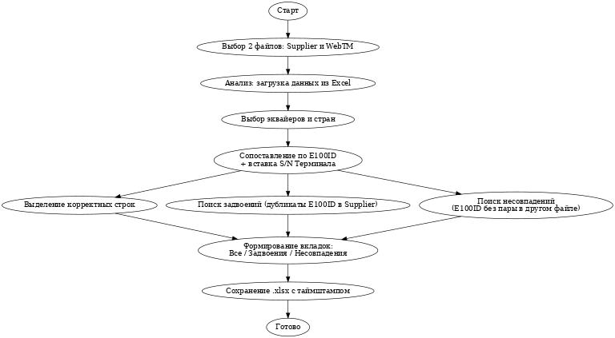

# give_me_my_network_for_win
____________________________________

⸻

🔄 Алгоритм работы программы:
	1.	Старт
	2.	📂 Пользователь выбирает 2 файла: Supplier и WebTM
	3.	📊 Программа загружает Excel-данные
	4.	🎛 Открывается окно фильтрации эквайеров и стран
	5.	🔍 По ключу E100ID:
	•	вставляется S/N Терминала
	•	строки сопоставляются
	6.	🧹 Определяются:
	•	✅ корректные строки (однозначные совпадения)
	•	🟡 задвоения в Supplier
	•	🔴 несовпадения в обоих направлениях
	7.	📑 Создаются вкладки:
	•	Все
	•	Задвоения
	•	Несовпадения
	8.	💾 Сохраняется итоговый .xlsx с таймштампом
	9.	🎉 Программа завершает работу

_____________________________________

Инструкция по использованию Give Me My Network
TableMerger — это утилита для автоматизированного объединения и анализа двух
Excel-таблиц, содержащих данные о топливных сетях. Программа сопоставляет
информацию по ключу E100ID (UID АЗС), позволяет фильтровать по эквайерам и
странам, а также формирует итоговый файл с распределением по вкладкам: все
корректные строки, дубли и несовпадения.
Как пользоваться программой
• • Запустите программу (на macOS или Windows — не требует установки или
админских прав).
• • В главном окне выберите:
• Файл 1: Выгрузка из Supplier
• Файл 2: Выгрузка из WebTM
• • Нажмите кнопку "Анализировать".
• • Во втором окне выберите нужные эквайеры и страны (при необходимости
используйте строку поиска).
• • Нажмите "Генерировать" — на выходе получите итоговый Excel-файл.
Описание вкладок итогового файла
🟢 Все — только корректно сопоставленные строки, без дублирований и
несовпадений. Чистый результат.
🟡 Задвоения — строки, где в Supplier повторяется один и тот же E100ID. Подсвечены
жёлтым.
🔴 Несовпадения — строки без пары по E100ID. Показывает, из какого файла строка
— Supplier или WebTM. Подсвечены красным.
Дополнительные детали
• "Источник данных" — указывает, из какого файла пришла строка.
• "S/N Терминала" — автоматически добавляется после колонки "Код Е100 / E100ID".
• Имя выходного файла включает дату и время генерации.
P.S.
Символ программы — уставший ленивец. Потому что всё, что раньше делали
вручную, теперь делает программа.
А Пашка — тот, кто не дождался команды разработки, и сделал это сам 😄
_________________________________________
